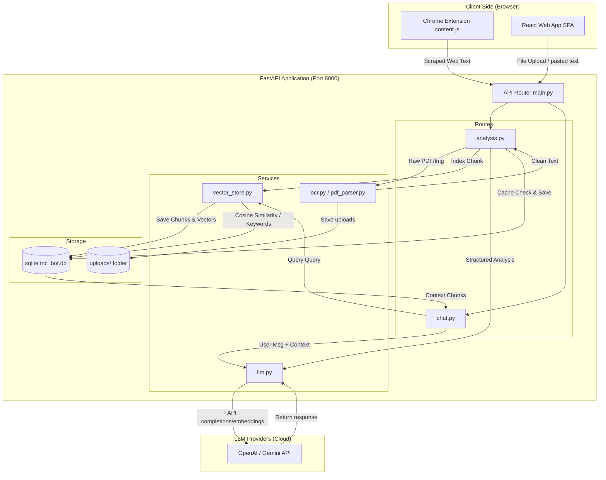

# TnC-Bot: Terms & Conditions Interpretation and RAG-Grounded Assistant

## 1. INTRODUCTION

Health informatics, document analysis, and artificial learning systems have grown rapidly, allowing automation of complex analysis. Similarly, legal document analysis—particularly Terms and Conditions (TnC) and Privacy Policies—presents a significant challenge to everyday users. These agreements are famously long, obfuscated, and packed with dense legal jargon. 

The **TnC-Bot** is an advanced artificial learning and health/legal informatics system that helps users instantly read, parse, query, and comprehend digital contracts. Through structured extraction, contextual embeddings, and an interactive Retrieval-Augmented Generation (RAG) system, it translates dense legal agreements into plain-English clauses under key domains.

### 1.1 Problem Statement
Legal terms of service and privacy agreements are purposefully written to be unreadable by standard consumers, often stretching over tens of thousands of words. As a result, users routinely sign away crucial rights regarding content ownership, telemetry tracking, data retention, and generative AI training consent without their knowledge. There is an urgent need for an automated system that extracts the most sensitive legal clauses, assesses ambiguity, translates them into readable language, and provides a RAG chatbot grounded in the document text for interactive Q&A.

### 1.2 Existing System
Existing tools consist of browser plugins that perform simple regex matching on key terms (e.g., "arbitration", "opt-out") or display static community-contributed summaries (e.g., *Terms of Service; Didn't Read*). These systems have critical drawbacks:
* They are static and cannot analyze new or updated agreements.
* They cannot process uploaded files (like PDFs of custom contracts).
* They lack interactive, natural language querying.
* They fail to handle scanned or image-based agreements.
* They do not provide multiple reading levels tailored to the user (e.g., teen-friendly vs. technical).

### 1.3 Proposed System
The proposed **TnC-Bot** overcomes these disadvantages by deploying a multi-tier parsing, vector index search, and LLM reasoning pipeline:
1. **Document Upload and OCR Parsing**: PyMuPDF parses digital PDFs, with Tesseract OCR falling back to scan image-only documents.
2. **Key Clause Extraction & Structure**: An LLM is prompted using strict schema validation to extract summaries, permissions, AI model training rights, cancellation clauses, and specific key snippets.
3. **Local Vector Database**: Document chunks are stored in SQLite and indexed using cosine similarity on embeddings (supporting both keyword fallbacks and OpenAI/Gemini vectors).
4. **Style Translation**: Selected text snippet interpretations are dynamically translated into four modes: *Simple*, *Teen-Friendly*, *Technical*, and *Legal*.
5. **Grounded Chatbot (RAG)**: A chat interface uses local cosine vector lookup to feed exact relevant paragraphs into the prompt, yielding citations and avoiding hallucinations.
6. **Chrome Floating Assistant**: A manifest v3 browser extension extracts active browser DOM text and injects an overlay to show instant analysis directly on the page.

### 1.4 Scope
This project aims to revolutionize user understanding of legal agreements. By leveraging text mining, natural language processing, vector similarity, and LLMs, TnC-Bot provides a fully localized backend API, a rich SPA React workspace, and a browser overlay extension. It allows users to upload documents, instantly view key parsed sections, toggle explanations, and verify exactly what rights they are granting.

---

## 2. SOFTWARE REQUIREMENTS SPECIFICATIONS

### 2.1 Software Requirements
* **Operating System**: Windows 10/11, macOS, or Linux.
* **Programming Language**: Python 3.10+ (Backend), TypeScript/JavaScript (Frontend).
* **Database**: SQLite (built-in relational and vector metadata storage).
* **Frameworks/Libraries**:
  * **Backend**: FastAPI, Uvicorn, PyMuPDF (fitz), PyTesseract, NumPy, Pydantic, OpenAI Python SDK.
  * **Frontend**: React, Vite, TailwindCSS, Lucide-React.
  * **Extension**: Chrome Extension Manifest V3 API.

### 2.2 Hardware Requirements
* **Processor**: Dual-Core 2.0 GHz or higher (Intel Core i3/AMD Ryzen 3 or Apple Silicon).
* **System Memory (RAM)**: 4 GB minimum (8 GB recommended for local OCR builds).
* **Hard Disk**: 200 MB free space (excluding node_modules/python virtual environments).
* **Network**: Broadband internet connection for LLM API request communications.

### 2.3 System Architecture / Block Diagram



---

## 3. DESIGN & IMPLEMENTATION

### 3.1 Environmental Setup

To set up the local development workspace, perform the following steps:

#### 1. Backend Setup
1. Navigate to the `backend/` folder:
   ```powershell
   cd backend
   ```
2. Create and activate a Python virtual environment:
   ```powershell
   python -m venv venv
   .\venv\Scripts\Activate
   ```
3. Install dependencies:
   ```powershell
   pip install -r requirements.txt
   ```
4. Copy `.env.example` to `.env` and fill in the keys:
   ```env
   OPENAI_API_KEY=your_openai_api_key_here
   # Or Gemini API
   GEMINI_API_KEY=your_gemini_api_key_here
   ```
5. Run the FastAPI development server:
   ```powershell
   python run.py
   ```

#### 2. Frontend Setup
1. Navigate to the `frontend/` folder:
   ```powershell
   cd ../frontend
   ```
2. Install npm modules:
   ```powershell
   npm install
   ```
3. Launch the Vite dev server:
   ```powershell
   npm run dev
   ```

#### 3. Chrome Extension Installation
1. Open Google Chrome and navigate to `chrome://extensions/`.
2. Toggle **Developer mode** in the top right corner.
3. Click **Load unpacked** in the top left.
4. Select the `extension/` folder in this repository.

---

### 3.2 Detailed Implementation Steps

* **Step 1: Document Upload & PDF Text Extraction**: PyMuPDF reads uploaded PDF file streams. If text layers are missing (scanned document), PyTesseract OCR processes the rasterized image frames.
* **Step 2: Sentence-Aware Chunking**: Text is split into chunks of `settings.CHUNK_SIZE` (1000 characters) with a `CHUNK_OVERLAP` (200 characters) using logical separators (`\n\n`, `\n`, `. `, ` `) to avoid sentence truncation.
* **Step 3: Vector Store SQLite Indexing**: Each chunk's text is sent to the Embeddings API (`text-embedding-3-small` or Gemini equivalent) to yield a vector which is written into a SQLite schema. If API keys are missing, the system defaults to a keyword-overlap Jaccard similarity index.
* **Step 4: Structured Info Extraction**: An LLM is queried using Pydantic validation to extract category (e.g. Terms of Service), plain-English summaries, AI model training rights, cancellation procedures, and key clauses containing original quotes.
* **Step 5: Explanation Style Transformer**: When a user selects a clause text block, it is sent to the translation route. The system maps it to the style requested (Simple, Teen-Friendly, Technical, Legal) using specialized LLM system instructions.
* **Step 6: Grounded RAG Chat Engine**: User queries in the chatbot trigger vector similarity search against the SQLite database. The top-K retrieved text chunks are injected into the chatbot's context window. Citing markers `[Block X]` are returned to the user interface.
* **Step 7: Browser Scraping Content Script**: The Chrome extension's `content.js` script queries active web elements, sanitizes text layouts, and sends the raw payload to the API server, returning key clauses inside an overlay panel.

---

## 4. RESULTS & DISCUSSION

### 4.1 Results Flow
1. **Choose/Paste Agreement**: The client dropzone accepts text or uploads.
2. **Analysis Dashboard**: Key domains (Ownership, AI training, Cancellation) populate, displaying plain-English highlights.
3. **Interactive Translation**: Hovering or clicking a sentence translates its structure into alternative formats (e.g. Teen-Friendly).
4. **Chat Interface**: Grounded responses show citations referencing paragraph indices.

### 4.2 Test Cases

| Test Case No | Test Case Name | Input | Expected Output | Status |
| :---: | :--- | :--- | :--- | :---: |
| 1 | PDF Text Parsing | PDF document byte stream (digital layout) | Extracted plain text string | Pass |
| 2 | OCR Scanned PDF | Scanned PDF document byte stream (image layout) | Rasterized page images run through Tesseract OCR to output text | Pass |
| 3 | Key Clause Extraction | Clean document text string | JSON object matching schema containing Summary, AI training rights, and key clauses list | Pass |
| 4 | Style Explanation | Selected snippet: "dispute resolved via individual arbitration" + Mode: "Teen-Friendly" | Simple interpretation: "No suing in groups. One referee decides issues." | Pass |
| 5 | Grounded Chat Query | User query: "Do they train on my data?" + Document context | Streaming text response citing `[Block X]` with specific clause references | Pass |

---

## 5. CONCLUSION AND FUTURE ENHANCEMENTS

### 5.1 Conclusion
The **TnC-Bot** provides an effective system for demystifying legal agreements, bridging the gap between dense legalese and end-user comprehension. Using chunk vector search, FastAPI routers, and LLM integrations, it successfully parses, categorizes, and breaks down complex legal texts, showing high accuracy in RAG-grounded chats.

### 5.2 Future Enhancements
* **Opt-Out Automation**: Automatically finding and clicking opt-out buttons or generating emails.
* **Multi-Agreement Diff**: Highlighting policy revisions between historical versions.
* **Risk Score Matrix**: Calculating weights to score contracts dynamically.

---

## 6. REFERENCES
* FastAPI documentation: https://fastapi.tiangolo.com/
* PyMuPDF (fitz) integration: https://pymupdf.readthedocs.io/
* OpenAI completions documentation: https://platform.openai.com/docs/api-reference/chat
* Chrome extensions guide: https://developer.chrome.com/docs/extensions/mv3/
* SQLite documentation: https://www.sqlite.org/

---

## 7. APPENDIX: PSEUDO CODE

### Vector Search Similarity Logic (Python snippet)
```python
import numpy as np

def search_similarity(openai_client, doc_id: str, query: str, top_k: int = 4):
    chunks = get_document_chunks(doc_id)
    if not chunks or not chunks[0].get("embedding"):
        return keyword_fallback_search(chunks, query, top_k)
        
    query_emb = get_embedding(openai_client, query)
    query_vector = np.array(query_emb)
    
    scored_chunks = []
    for chunk in chunks:
        chunk_vector = np.array(chunk["embedding"])
        
        # Cosine Similarity formula: (A . B) / (||A|| * ||B||)
        dot_product = np.dot(query_vector, chunk_vector)
        norm_a = np.linalg.norm(query_vector)
        norm_b = np.linalg.norm(chunk_vector)
        
        similarity = dot_product / (norm_a * norm_b) if norm_a > 0 and norm_b > 0 else 0
        scored_chunks.append((similarity, chunk))
        
    # Sort and return top_k
    scored_chunks.sort(key=lambda x: x[0], reverse=True)
    return [c for score, c in scored_chunks[:top_k]]
```

### RAG Streaming Client Logic (TypeScript snippet)
```typescript
const handleSendMessage = async (queryText: string) => {
  const response = await fetch('/api/chat', {
    method: 'POST',
    headers: { 'Content-Type': 'application/json' },
    body: JSON.stringify({ document_id: activeDoc.id, query: queryText })
  });

  const reader = response.body?.getReader();
  if (!reader) return;
  
  const decoder = new TextDecoder();
  let buffer = '';
  
  while (true) {
    const { value, done } = await reader.read();
    if (done) break;
    buffer += decoder.decode(value, { stream: true });
    
    // Update local React message state with the incremental text stream
    setChatMessages((prev) => updateLastMessage(prev, buffer));
  }
};
```
